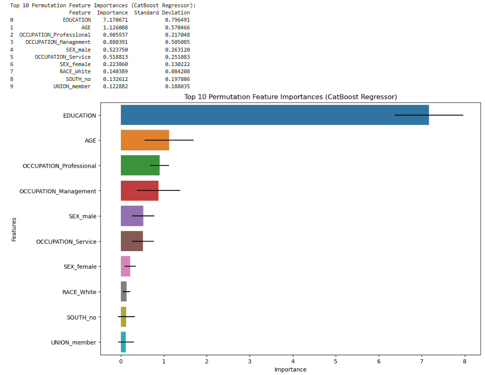
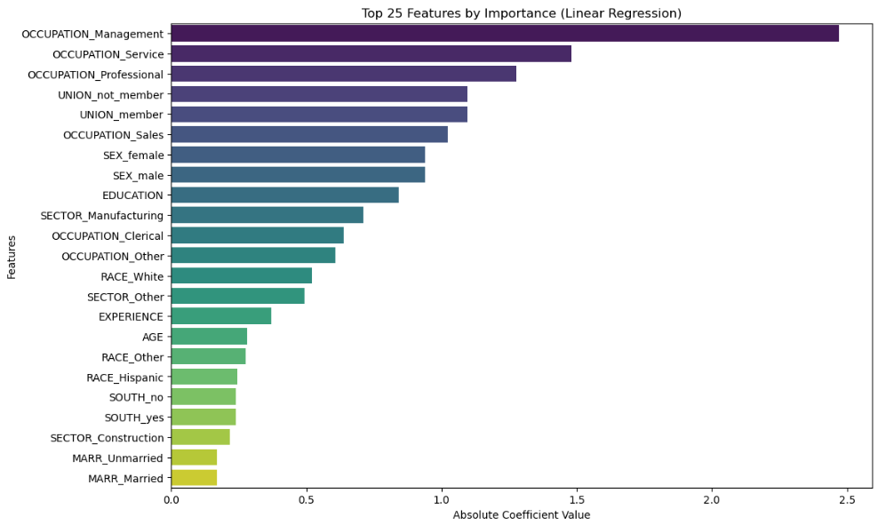
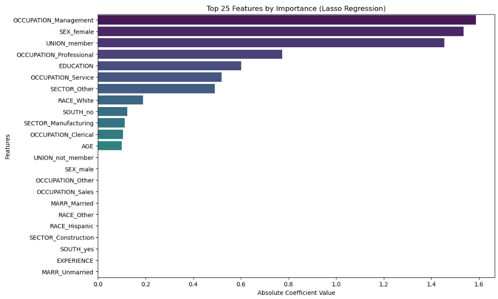
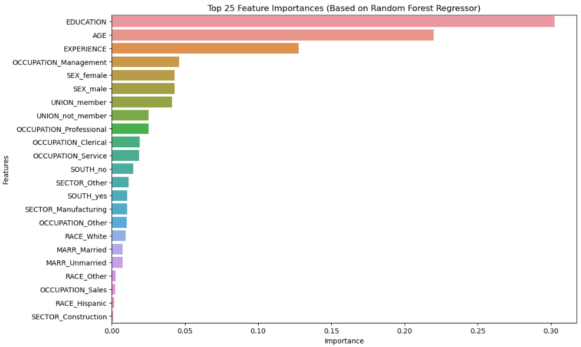
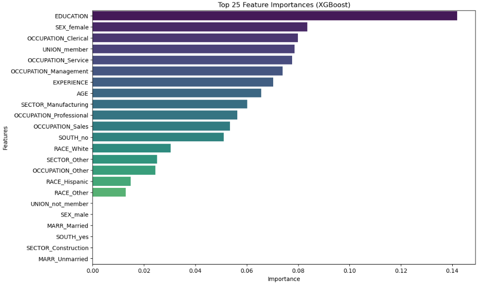
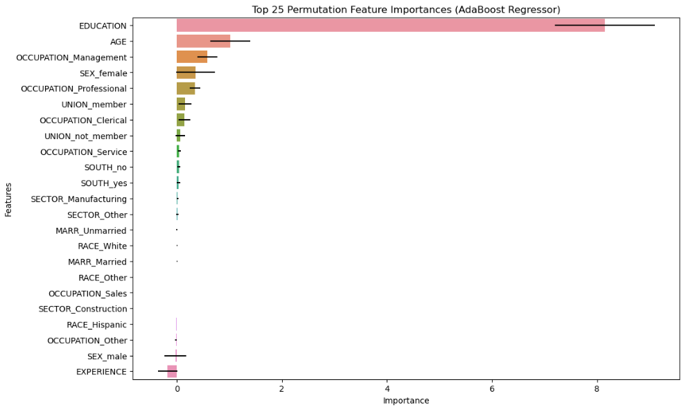

### Analyzing the Efficacy of Machine Learning Regression Models for Wage Estimation

#### Problem Statement

Accurate wage prediction is essential for a variety of applications including economic forecasting, salary negotiations, and labor market analysis. Given the rapid evolution in machine learning, a diverse set of regression models is available, each with its unique strengths. Traditional models such as Linear Regression, Lasso, and Ridge Regression offer foundational techniques for understanding wage determinants, while more advanced algorithms like Gradient Boosting, Random Forest, K-Nearest Neighbors (KNN), Decision Tree, Support Vector Regression (SVR), AdaBoost, XGBoost, and CatBoost leverage sophisticated methodologies to enhance predictive accuracy through complex transformations and ensemble methods.

This project seeks to evaluate and compare the performance of these diverse machine learning regression models for predicting wages. The aim is to determine how effectively each model captures wage determinants and to identify the most accurate approach for wage prediction. By analyzing performance metrics such as R-squared, RMSE, and MAE, this study will provide valuable insights into the strengths and limitations of each model, aiding in the selection of the best method for practical wage prediction applications.

#### Introduction

Predicting wages with high accuracy has significant implications for both individuals and organizations. Effective wage predictions can lead to fair salary setting, deeper market insights, and better economic decision-making. With a broad spectrum of regression models available, selecting the most suitable approach is critical for achieving optimal predictive performance.

In this analysis, we compared the efficacy of several machine learning regression models to ascertain their performance in wage prediction. The models examined include:

- **Linear Regression**: A fundamental technique assuming a linear relationship between predictors and the target variable. It is straightforward with no hyperparameters to tune and focuses on finding the line that best fits the data.

- **Lasso Regression**: An extension of linear regression that incorporates L1 regularization. The alpha parameter controls the strength of regularization, with a value of 0.1 balancing model fit and feature sparsity.

- **Ridge Regression**: Another variant of linear regression that uses L2 regularization to address multicollinearity. The alpha parameter (set at 10) helps in controlling the complexity of the model by shrinking coefficients.

- **Gradient Boosting**: An ensemble method that builds models sequentially, correcting errors from previous models. Key parameters include a learning rate of 0.1, a maximum tree depth of 5, a minimum samples split of 5, and 10 estimators.

- **Random Forest**: An ensemble learning technique that combines multiple decision trees to improve accuracy and control overfitting. Important hyperparameters are a maximum tree depth of 10, a minimum samples leaf of 4, a minimum samples split of 10, and 200 trees.

- **K-Nearest Neighbors (KNN)**: A non-parametric method predicting values based on the proximity of data points. Parameters include 10 neighbors and uniform weighting for all neighbors.

- **Decision Tree**: A model that partitions data into subsets based on feature values. Key parameters are a maximum depth of 10, a minimum samples leaf of 4, and a minimum samples split of 5.

- **Support Vector Regression (SVR)**: Uses support vector machines to fit data within a margin of tolerance. The parameters include a regularization parameter C of 0.1, an epsilon of 0.01, and a linear kernel.

- **AdaBoost**: An ensemble method that combines weak learners to create a strong model. Parameters include a learning rate of 0.01 and 200 boosting stages.

- **XGBoost**: A scalable and efficient gradient boosting framework with parameters including a learning rate of 0.01, a maximum tree depth of 3, and 200 boosting rounds.

- **CatBoost**: A gradient boosting library that efficiently handles categorical features. Parameters include a tree depth of 3, 50 iterations, and a learning rate of 0.1.

The goal of this comparative analysis is to evaluate each model’s ability to predict wages, highlighting their performance characteristics and identifying the most effective approach for wage prediction. This will contribute to a better understanding of how different models handle wage prediction and provide guidance on selecting the most suitable model for specific applications.

***Methodology***<br>


**Data Sources:** census data loaded using the fetch_openml function was used for the study. <br>
**Feature and Target Variables:** The dataset was split into features (X) and target labels (y). Furthermore, it was split into training and test sets using python's `train_test_split` function.<br>

**Variable Description:**<br>

```

 #   Column      Non-Null Count  Dtype   
---  ------      --------------  -----   
 0   EDUCATION   534 non-null    int64   
 1   SOUTH       534 non-null    category
 2   SEX         534 non-null    category
 3   EXPERIENCE  534 non-null    int64   
 4   UNION       534 non-null    category
 5   WAGE        534 non-null    float64 
 6   AGE         534 non-null    int64   
 7   RACE        534 non-null    category
 8   OCCUPATION  534 non-null    category
 9   SECTOR      534 non-null    category
 10  MARR        534 on-null     category

```
 **Data Preprocessing:** Included cleaning, handling duplicates and missing data, visualization, and feature engineering including one-hot encoding of categorical features.<br>

 **Model Training and Evaluation** <br>

**Hyperparameter Tuning:** Used GridSearchCV with 5-fold cross-validation to optimize hyperparameters for each model and measured the training duration.<br>

**Performance Metrics:** <br>
- **R-Squared (R²)**: Measures how well the model explains the variance of the dependent variable (Target). A higher R² indicates a better fit.
- **RMSE (Root Mean Squared Error)**: Measures the average magnitude of the errors in predictions. Lower RMSE values indicate better performance.
- **MAE (Mean Absolute Error)**: Measures the average absolute difference between predicted and actual values. Lower MAE values indicate better performance.

**Results:** Descriptive Statistics

 ```
Summary statistics for WAGE by SOUTH:
       Count  Mean  Std Dev  Min   P1   P5   Q1  Median    Q3   P95   P99   Max
SOUTH                                                                          
no    378.00  9.49     5.23 1.00 3.35 3.63 5.63    8.60 12.00 20.42 24.98 44.50
yes   156.00  7.90     4.74 1.75 2.55 3.41 4.54    6.25 10.00 18.59 23.34 26.29

Summary statistics for WAGE by SEX:
        Count  Mean  Std Dev  Min   P1   P5   Q1  Median    Q3   P95   P99   Max
SEX                                                                             
female 245.00  7.88     4.72 1.75 3.15 3.50 4.75    6.80 10.00 14.86 24.22 44.50
male   289.00  9.99     5.29 1.00 3.29 3.56 6.00    8.93 13.00 20.97 24.98 26.29

Summary statistics for WAGE by UNION:
            Count  Mean  Std Dev  Min   P1   P5   Q1  Median    Q3   P95   P99   Max
UNION                                                                               
member      96.00 10.80     4.56 3.00 3.48 4.96 7.65   10.00 13.00 20.12 25.05 26.00
not_member 438.00  8.64     5.18 1.00 3.13 3.50 5.00    7.07 10.62 19.98 24.98 44.50

Summary statistics for WAGE by RACE:
          Count  Mean  Std Dev  Min   P1   P5   Q1  Median    Q3   P95   P99   Max
RACE                                                                              
Hispanic  27.00  7.28     5.52 3.00 3.13 3.52 4.50    5.20  7.69 20.86 24.99 25.00
Other     67.00  8.06     4.08 3.35 3.35 3.35 4.71    7.50 10.00 14.90 19.46 23.25
White    440.00  9.28     5.23 1.00 3.14 3.60 5.50    8.00 11.73 20.00 24.98 44.50

Summary statistics for WAGE by OCCUPATION:
              Count  Mean  Std Dev  Min   P1   P5   Q1  Median    Q3   P95   P99   Max
OCCUPATION                                                                            
Clerical      97.00  7.42     2.70 3.00 3.34 3.54 5.20    7.50  9.50 12.03 12.60 15.03
Management    55.00 12.70     7.57 1.00 2.27 4.24 7.25   10.62 16.39 24.98 34.67 44.50
Other        156.00  8.43     4.25 2.85 3.19 3.61 5.00    7.15 10.76 16.00 21.29 26.00
Professional 105.00 11.95     5.52 4.35 5.00 5.71 7.50   10.61 15.38 22.76 24.98 24.98
Sales         38.00  7.59     4.23 3.35 3.35 3.48 4.31    5.72 10.83 14.40 18.14 19.98
Service       83.00  6.54     3.67 1.75 1.96 3.40 3.96    5.50  8.00 13.09 17.83 25.00

Summary statistics for WAGE by SECTOR:
               Count  Mean  Std Dev  Min   P1   P5   Q1  Median    Q3   P95   P99   Max
SECTOR                                                                                 
Construction   24.00  9.22     3.36 3.75 3.88 4.34 6.75    9.75 11.49 14.85 15.00 15.00
Manufacturing  99.00  9.60     4.97 3.00 3.34 3.48 5.73    9.00 12.00 20.02 22.87 24.98
Other         411.00  8.87     5.26 1.00 3.03 3.50 5.18    7.50 11.23 19.99 24.98 44.50

Summary statistics for WAGE by MARR:
           Count  Mean  Std Dev  Min   P1   P5   Q1  Median    Q3   P95   P99   Max
MARR                                                                               
Married   350.00  9.40     4.93 1.00 3.17 3.50 5.62    8.60 12.00 19.99 24.98 26.29
Unmarried 184.00  8.31     5.47 2.01 3.27 3.43 4.60    6.58 10.00 18.92 24.98 44.50
 ```

**Model Comparison**
 ```
Summary of Results:
                Model  Train Time  R-Squared  RMSE   MAE
0   Linear Regression        0.00       0.35  4.25  3.08
1               Lasso        0.00       0.34  4.27  3.19
2               Ridge        0.00       0.36  4.22  3.08
3   Gradient Boosting        0.02       0.19  4.74  3.39
4       Random Forest        0.21       0.36  4.22  3.09
5          KNeighbors        0.00       0.20  4.71  3.58
6       Decision Tree        0.00       0.28  4.46  3.29
7                 SVR        0.01       0.28  4.47  3.16
8            AdaBoost        0.22       0.31  4.37  3.30
9             XGBoost        0.04       0.28  4.45  3.29
10           CatBoost        0.03       0.36  4.22  3.14
11   Voting Regressor        0.56       0.35  4.24  3.14

Best Parameters for Linear Regression:
{}

Best Parameters for LASSO:
{'alpha': 0.1}

Best Parameters for Ridge:
{'alpha': 10}

Best Parameters for Gradient Boosting:
{'learning_rate': 0.1, 'max_depth': 5, 'min_samples_split': 5, 'n_estimators': 10}

Best Parameters for Random Forest:
{'max_depth': 10, 'min_samples_leaf': 4, 'min_samples_split': 10, 'n_estimators': 200}

Best Parameters for KNeighbors:
{'n_neighbors': 10, 'weights': 'uniform'}

Best Parameters for Decision Tree:
{'max_depth': 10, 'min_samples_leaf': 4, 'min_samples_split': 5}

Best Parameters for SVR:
{'C': 0.1, 'epsilon': 0.01, 'kernel': 'linear'}

Best Parameters for AdaBoost:
{'learning_rate': 0.01, 'n_estimators': 200}

Best Parameters for XGBoost:
{'learning_rate': 0.01, 'max_depth': 3, 'n_estimators': 200}

Best Parameters for CatBoost:
{'depth': 3, 'iterations': 50, 'learning_rate': 0.1}

 ```

**Best Parameters for Each Model**

- **Linear Regression**: No hyperparameters.
- **Lasso**: `alpha`: 0.1
- **Ridge**: `alpha`: 10
- **Gradient Boosting**: `learning_rate`: 0.1, `max_depth`: 5, `min_samples_split`: 5, `n_estimators`: 10
- **Random Forest**: `max_depth`: 10, `min_samples_leaf`: 4, `min_samples_split`: 10, `n_estimators`: 200
- **KNeighbors**: `n_neighbors`: 10, `weights`: 'uniform'
- **Decision Tree**: `max_depth`: 10, `min_samples_leaf`: 4, `min_samples_split`: 5
- **SVR**: `C`: 0.1, `epsilon`: 0.01, `kernel`: 'linear'
- **AdaBoost**: `learning_rate`: 0.01, `n_estimators`: 200
- **XGBoost**: `learning_rate`: 0.01, `max_depth`: 3, `n_estimators`: 200
- **CatBoost**: `depth`: 3, `iterations`: 50, `learning_rate`: 0.1

**Interpretation**

1. **Model Comparison**:
   - **Best Performers**: `Random Forest` and `CatBoost` both have high R² scores (0.36), indicating they explain the most variance in the data. CatBoost also has the lowest RMSE and MAE among the models, making it the best performer overall.
   - **Worst Performers**: `Gradient Boosting` performs the worst with an R² of 0.19, indicating it explains the least variance. It also has the highest RMSE and MAE, indicating poor prediction accuracy.
   - **Linear** and **Ridge Regression**: Both models show similar R² scores (0.35 for `Linear Regression` and 0.36 for Ridge) but have slightly different error metrics. `Ridge Regression` has a slightly better RMSE and MAE compared to `Linear Regression`.

2. **Training Time**:
   - **Fastest Models**: `Linear Regression`, `Lasso`, and `KNeighbors` are the fastest, each with a training time of 0.00 to 0.02 seconds.
   - **Slowest Models**: `Voting Regressor`, `Random Forest`, and `AdaBoost` take longer to train. The `Voting Regressor` is the slowest, with a training time of 0.56 seconds.

3. **Hyperparameters**:
   - Models with specific hyperparameters (e.g., Lasso, Ridge, XGBoost) are tuned to find the best performance. 
   - `Random Forest` and `XGBoost` have complex hyperparameter settings, contributing to their better performance but also their longer training times.

**Conclusion**

- **CatBoost** emerged as the best model overall based on its R², RMSE, and MAE scores. It balanced performance and training time effectively.
- **Gradient Boosting** and **AdaBoost** performed less well compared to other models, suggesting they were not the best choices for this dataset.
- **Voting Regressor** combined multiple models but it was slower to train compared to individual models, though its performance was comparable to other top models.

Overall, the choice of model depends on the trade-off between performance and training time that fits one's specific needs.

**Important Features**














The most frequently used predictors for estimating hourly wages included education level, age, occupation, gender, and union membership.


Links to important files<br>
[Graphs Folder](Graphs/)<br>
[Notebook Folder](Files/)<br>


